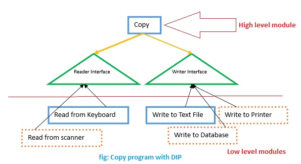

# Dependency Inversion Principle
### Phát biểu
- Các lớp high-level không được phụ thuộc vào các lớp low-level.
- Thay vì để các lớp high-level sử dụng các interface do các lớp low-level định nghĩa và thực thi, 
thì nguyên lý này chỉ ra rằng các lớp high-level sẽ định nghĩa ra các interface, sau đó các lớp low-level sẽ thực thi
các interface đó, (đảo ngược ở chỗ đó)
### Giải thích
- Nếu không áp dụng nguyên lý  này thì các lớp cấp cao phải phụ thuộc các interface của các lớp cấp thấp. 
- Với kiểu design như vậy thì các lớp cấp cap phải biết interface của tất cả các lớp con, khi thêm một thêm 1 lớp cấp thấp
vào chúng ta phải tiến hành thay đổi lớp cấp cao để nó có thể hiệu được interface của lớp mới thêm vào. Điều này gây
ra rất nhiều khó khăn trong việc chỉnh sửa, nó vi phạm nguyên lý Open Closed
### Class diagram
