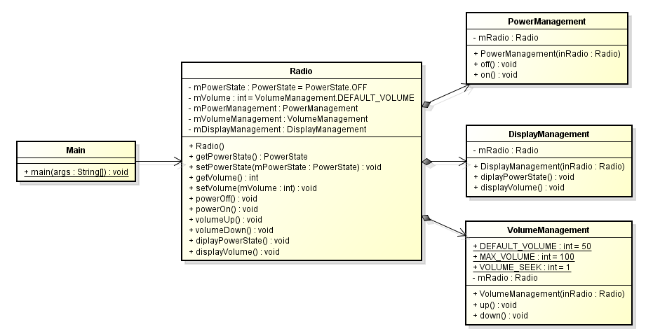

# Single Responsibility Principle
### Phát biểu
- Một class chỉ nên thực hiện một nhiệm vụ đơn lẻ.
- Nếu chỉnh sửa class thì chỉ nên có 1 và chỉ 1 lý do.
### Giải thích
- Nguyên lý khuyên chúng ta nên thiết kế một lớp chỉ nên để nó đảm nhận duy nhất 1 nhiệm vụ, chức năng duy nhất.
- Nếu chúng ta gom nhiều chức năng cho một lớp, khi chúng ta thay đổi chức năng nào đó dẫn đến toàn bộ lớp đó phải thay đổi.
- Khi có nhiều thay đổi thì sẽ phát sinh ra nhiều vấn đề gây ra lỗi khiến chúng ta phải test lại toàn bộ lớp đó.
- Ví dụ: Chúng ta có 1 lớp khoảng 1000 dòng code viết cách đây nhiều năm, đã chảy ổn định.
Vào một ngày vì một lý do nào đó chúng ta vào thay đổi lớp đó, dó vậy chúng ta không thể đảm bảo các thành phần khác trong lớp không bị ảnh hưởng.
Do vậy chúng ta lại phải mất công test lại toàn bộ lớp đó 1 lần nữa.
### Class diagram
